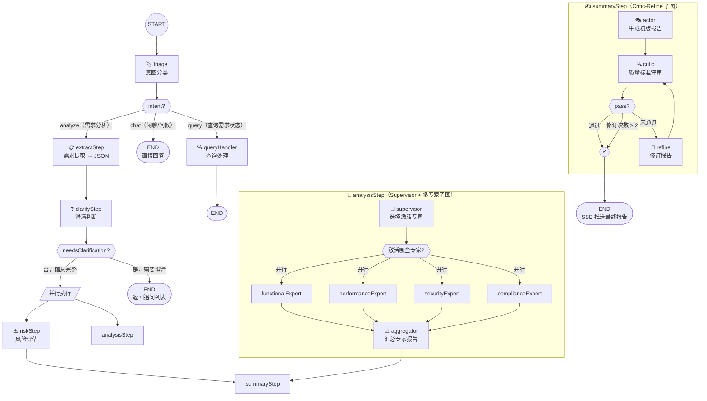
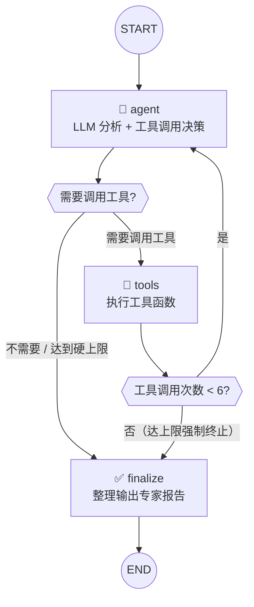
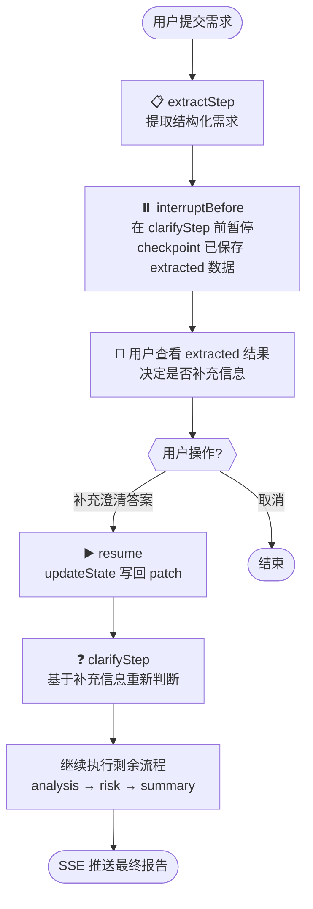
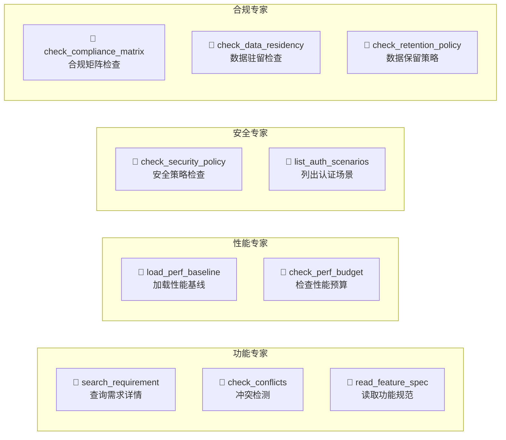

# 需求分析流程图

## 整体流程（Main Graph）

## 专家子图内部结构（ReAct 循环）

每个专家（functional / performance / security / compliance）都是一个独立的 ReAct 子图：

## HITL 流程（带 Checkpoint 的人机协同）

## 工具分配总览

## 文件索引

| 组件 | 文件路径 |
|------|----------|
| 主图定义 + HITL | `services/chat/src/llm/graph/requirement-analysis-graph.ts` |
| 专家子图 + Supervisor | `services/chat/src/llm/graph/experts.ts` |
| 功能/冲突工具（2个） | `services/chat/src/llm/tools/analysis-tools.ts` |
| 专家工具（8个） | `services/chat/src/llm/tools/expert-tools.ts` |
| 编排入口 | `services/chat/src/llm/agents/orchestrator.service.ts` |
| SSE 推送端点 | `services/chat/src/conversation/conversation.controller.ts` |
| Plan-and-Execute 流水线 | `services/chat/src/llm/graph/pipeline.ts` |
